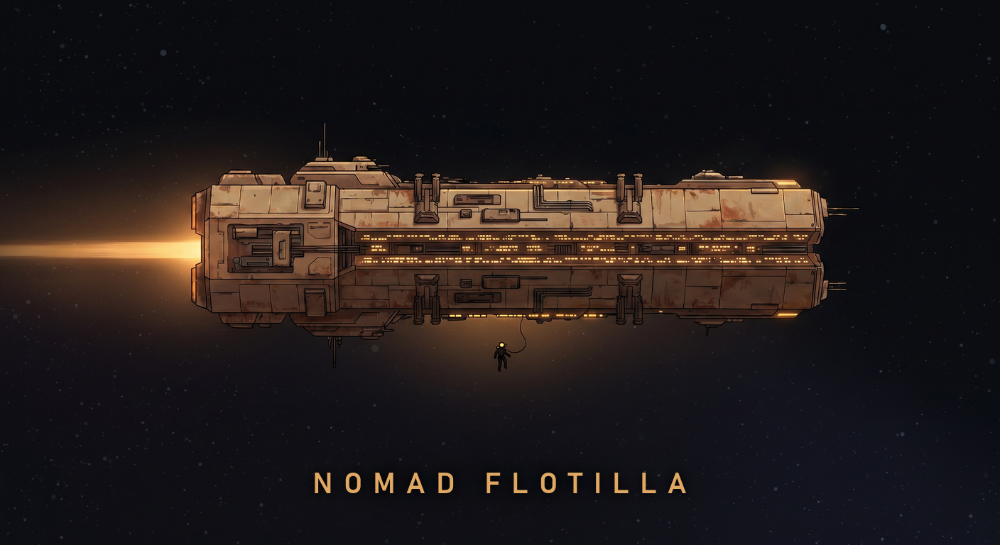
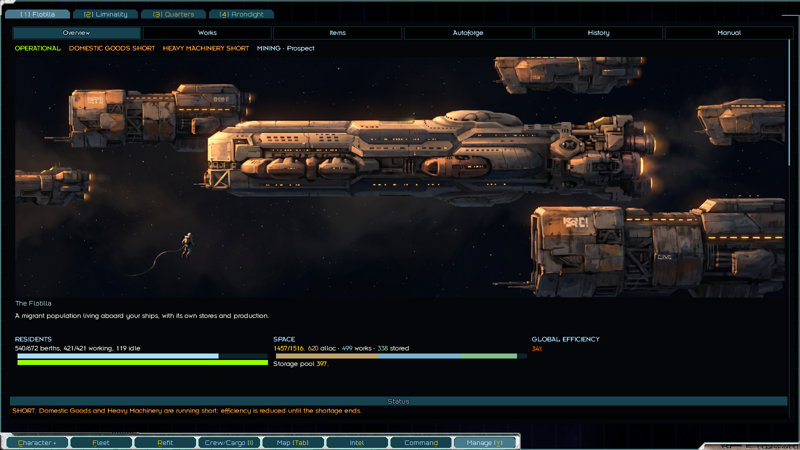
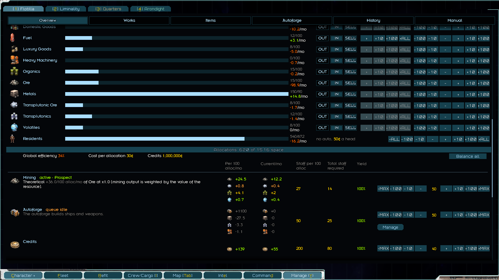
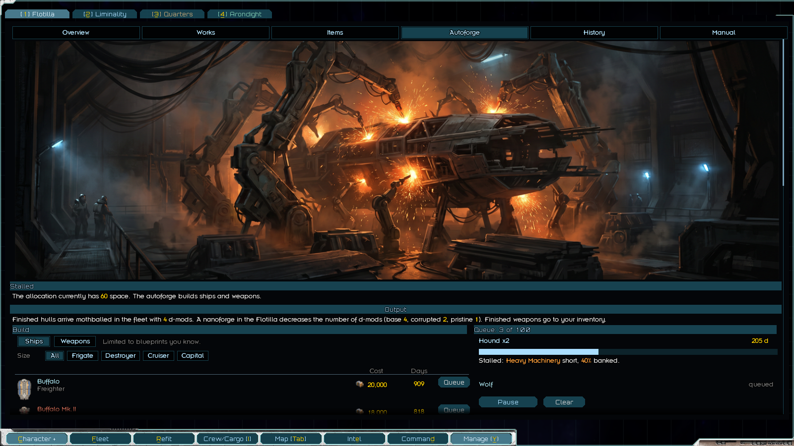
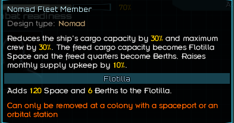

# Nomad Flotilla
> A home away from home that is also a real home.

A migrant population, the Flotilla, moves aboard your ships. Nomad hullmods turn a ship's cargo space and crew quarters into working room and berths, and the residents run their own production: hydroponics, forge-vats, mining, and an autoforge that builds ships or weapons.

No required dependencies. Can be added to existing saves.

[Forum link](https://fractalsoftworks.com/forum/index.php?topic=35859.0)

## Screenshots

